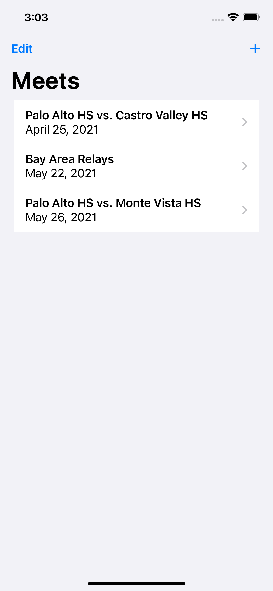
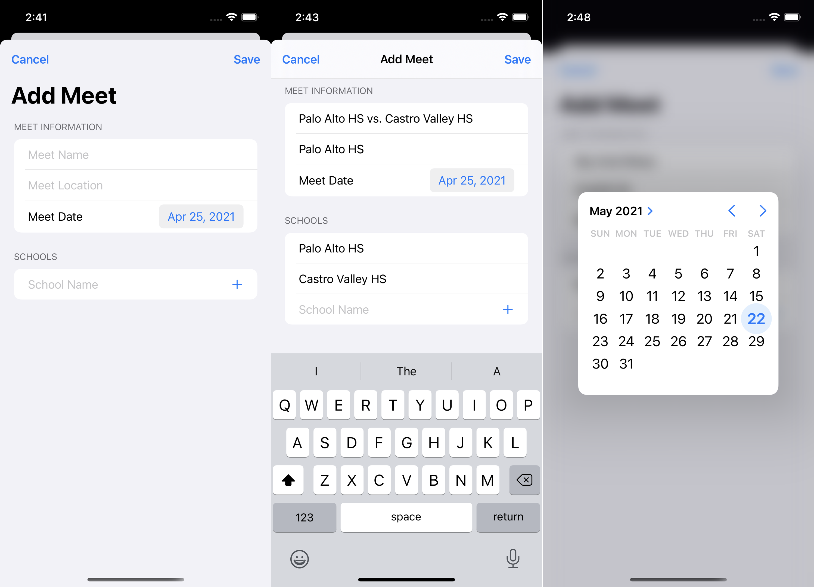
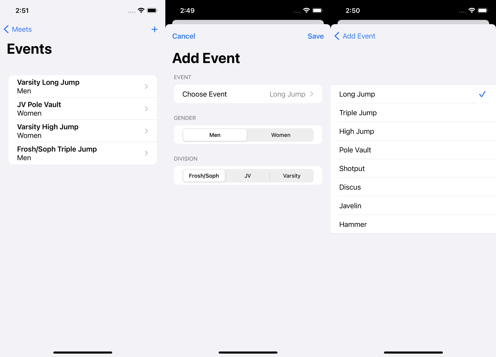
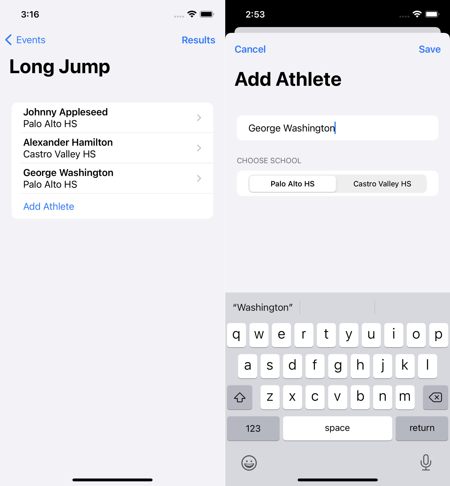
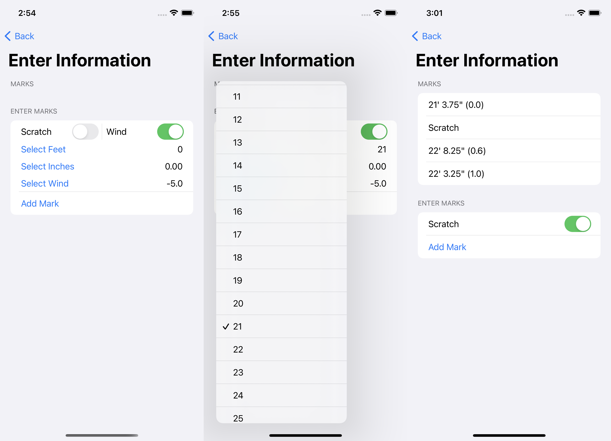
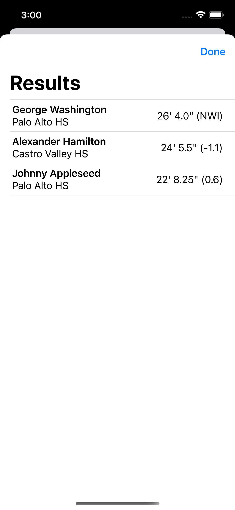

# Field Event Tracker

This app is intended to help schools host and manage track meets. It allows you to easily manage field event marks and determine athletes' positions.

## Overview

To get started, you'll need to add meets using the "+" at the top right.

Add the meet you are hosting and enter the relevant information.

Next, add the event you're currently scoring and the division it's for.

Enter the athletes that are competing in the event you chose, specifying their school. View results at the top right.

Enter the marks for each athlete as they make their attempt. Marking an attempt as a scratch prevents you from adding any other information.

The results page shows each athlete, ranked by their best attempt. If the best attempt is a tie, the next best attempt is the tie-breaker. "NWI" indicates that no wind reading was entered.

